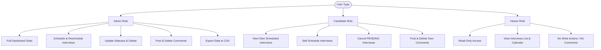

# 🗓️ InterviewHub - Interview Manager System

Welcome to **InterviewHub**, a premium, real-time interview management platform. The application is built with a highly responsive **React + TypeScript + Tailwind CSS** frontend, and a robust **Django + Django REST Framework + Django Channels (WebSockets)** backend. It features seamless role-based workflows for **Admins**, **Candidates**, and **Viewers** to schedule, track, comment on, and manage the interview pipeline.

---

## 🚀 Quick Start Guide

### 1. Prerequisites
Ensure you have the following installed on your system:
- **Python 3.10+**
- **Node.js 18+ & npm**
- **Redis Server** (required for WebSocket channel layer)
- *Optional*: **Docker & Docker Compose**

---

### 2. Local Development Setup

#### 📂 Backend Setup
1. **Navigate to the backend directory**:
   ```bash
   cd backend
   ```

2. **Activate the Virtual Environment**:
   - **PowerShell** (Windows):
     ```powershell
     ..\.venv\Scripts\Activate.ps1
     ```
   - **Command Prompt (CMD)**:
     ```cmd
     ..\.venv\Scripts\activate.bat
     ```
   - **Bash / Git Bash**:
     ```bash
     source ../.venv/Scripts/activate
     ```

3. **Install Dependencies**:
   ```bash
   pip install -r requirements.txt
   ```

4. **Configure Environment Variables**:
   Create a `.env` file in the `backend/` folder (or verify the existing one):
   ```env
   SECRET_KEY=django-insecure-your-secret-key-here
   DEBUG=True
   DATABASE_URL=sqlite:///db.sqlite3
   REDIS_URL=redis://localhost:6379/0
   JWT_ACCESS_TOKEN_LIFETIME_MINUTES=15
   JWT_REFRESH_TOKEN_LIFETIME_DAYS=7
   DEFAULT_FROM_EMAIL=noreply@interviewhub.com
   FRONTEND_URL=http://localhost:5173
   CORS_ALLOWED_ORIGINS=http://localhost:5173
   ```

5. **Run Migrations**:
   ```bash
   python manage.py migrate
   ```

6. **Start the Django/Daphne Server**:
   ```bash
   python manage.py runserver
   ```
   *Note: For production WebSockets, Daphne can be run directly using:*
   ```bash
   daphne -b 0.0.0.0 -p 8000 config.asgi:application
   ```

---

#### 💻 Frontend Setup
1. **Navigate to the frontend directory**:
   ```bash
   cd ../frontend
   ```

2. **Install Packages**:
   ```bash
   npm install
   ```

3. **Start the Frontend Dev Server**:
   ```bash
   npm run dev
   ```
   Open [http://localhost:5173](http://localhost:5173) in your browser to view the application.

---

### 3. Docker Compose Setup (Single Command Startup)
To spin up the entire production-ready system (Postgres Database, Redis Server, Daphne Backend, Nginx reverse-proxy, and React frontend):

```bash
docker-compose up --build
```
Access the application at [http://localhost](http://localhost).

---

## 👥 Role-Based Workflows & Permissions

InterviewHub enforces strict role-based access control (RBAC) across the dashboard, calendars, views, and API endpoints.



### 🗝️ Pre-Configured Test Credentials
Use these accounts to test the application flows:

| Name | Email Address | Role | Default Password | Description |
| :--- | :--- | :--- | :--- | :--- |
| **System Admin** | `admin@interviewhub.com` | **ADMIN** | `Password123` | Full dashboard access, export functions, scheduling control. |
| **John Doe** | `candidate@interviewhub.com` | **CANDIDATE** | `Password123` | Accesses candidate portal to self-schedule/cancel. |
| **Guest Viewer** | `viewer@interviewhub.com` | **VIEWER** | `Password123` | Read-only access to calendar, notices, and lists. |

> [!TIP]
> If a test account role needs resetting to `VIEWER` or `ADMIN`, execute this command in the backend Django shell:
> ```bash
> python manage.py shell
> ```
> ```python
> from django.contrib.auth import get_user_model
> User = get_user_model()
> u = User.objects.get(email="viewer@interviewhub.com")
> u.role = "VIEWER"
> u.save()
> ```

---

### 📋 Role Actions Breakdown

#### 👑 Admin Role Workflow
- **Dashboard & Statistics**: View aggregated analytics, interview statuses, and department breakdown charts.
- **Full Pipeline Control**: Schedule new interviews for any email, edit existing ones, update status (e.g., *Pending*, *Scheduled*, *Completed*, *Cancelled*), and permanently delete entries.
- **Collaboration**: Leave internal comments on interview detail sheets and remove any inappropriate comments.
- **Reporting**: Export standard filtered interview lists directly to a CSV document stream.

#### 🎓 Candidate Role Workflow
- **Self-Scheduling Portal**: Create/book an interview slot for their own profile. (Candidates are restricted to booking only for their registered email address).
- **Manage Bookings**: View their personal list of scheduled interviews.
- **Cancellation**: Cancel their own **PENDING** interviews. Completed or already scheduled interviews require Admin permission to modify.
- **Communication**: Chat on their active interview pages via comments. They can only delete comments they authored.

#### 👁️ Viewer Role Workflow
- **Read-Only Inspection**: Access the centralized Interview list, calendar layout, and global bulletin notices.
- **Zero Modifications**: Completely blocked from booking slots, updating statuses, writing comments, or altering records.

---

## ⚡ Real-Time WebSockets & Notifications

InterviewHub utilizes **Django Channels** and **Redis** to ensure instant updates without page refreshes:
1. **Live Scheduling**: When a new interview is scheduled or cancelled, other active Admins and Viewers immediately see the updates render on their dashboard lists and calendars.
2. **Instant Commenting**: Threaded discussions inside an Interview detail view update in real-time as users submit comments.
3. **Automated Emails**: Integrated with email templates to notify candidates and admins automatically when interviews are booked, status changes occur, or new comments are posted.

---

## 🛠️ REST API Reference Matrix

All write operations are validated against **Pydantic Schemas** for rigorous input sanity checks.

| Endpoint | Method | Allowed Roles | Description |
| :--- | :---: | :---: | :--- |
| `/api/auth/login/` | `POST` | *Anonymous* | Authenticates users and issues JWT Tokens. |
| `/api/interviews/` | `GET` | **ADMIN**, **CANDIDATE**, **VIEWER** | Fetch list of interviews (filtered based on query/role). |
| `/api/interviews/` | `POST` | **ADMIN**, **CANDIDATE** | Book an interview slot (Candidates only for themselves). |
| `/api/interviews/<id>/status/` | `PATCH` | **ADMIN** | Update status of an interview. |
| `/api/interviews/<id>/cancel/` | `PATCH` | **CANDIDATE** | Cancel own interview (only if *Pending*). |
| `/api/interviews/stats/` | `GET` | **ADMIN** | Get aggregations for the dashboard charts. |
| `/api/interviews/export/` | `GET` | **ADMIN** | Download filtered streaming CSV data. |
| `/api/interviews/<id>/comments/` | `GET` | **ADMIN**, **CANDIDATE**, **VIEWER** | Retrieve comment thread for an interview. |
| `/api/interviews/<id>/comments/` | `POST` | **ADMIN**, **CANDIDATE** | Add a new comment to the interview thread. |
| `/api/interviews/<id>/comments/<cid>/` | `DELETE` | **ADMIN**, **Author** | Remove comment from thread. |
